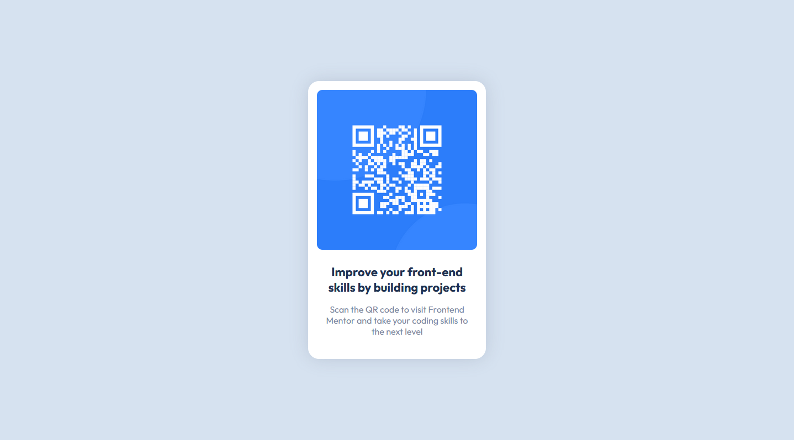

# My very first project and solution to the qr code component challenge from [Frontend Mentor](https://www.frontendmentor.io/challenges)

## Table of contents
- [The challenge](#the-challenge)
- [Goals](#goals)
- [Assignment design](#this-was-the-design)
- [My solution with live page link](#this-is-my-solution)
- [What I learned](#what-i-learned)
- [Tools used](#tools-used)

## The challenge

My challenge is to build out this component and get it looking as close to the design as possible.

I can use any tools I like to help me complete the challenge. So if I've got something I'd like to practice, I can feel free to give it a go.

My users should be able to:

- View the optimal layout depending on their device's screen size
- See hover states for interactive elements

## Goals

My goals for this project were to:

- [x] Create my first pure HTML and CSS site
- [x] Put what I learned in my basic HTML and CSS knowledge to use

## This was the design

## This is my solution

[Click here to see the live page](https://arthurpog.github.io/qr-code-component/)

## What I learned

I mainly learned to vertically center something on a page which was so much harder then I initially thought it would be.

## Tools used

- **CodePen** - I coded this whole thing in CodePen because I wanted to be introduced to any new IDE's just yet.

- **Microsoft PowerToys** - A nifty little program from Microsoft adding a *plethora* of UI functionality to Windows. What I use most for coding is CTRL+WIN+C it brings up a colour picker, and when I hover over something or click something it shows me the HEX, RGB, HSL and CMYK values of the colour that can instantly be copied to the clipboard and in addition to this it keeps a history of all the colours picked. Amazing!
